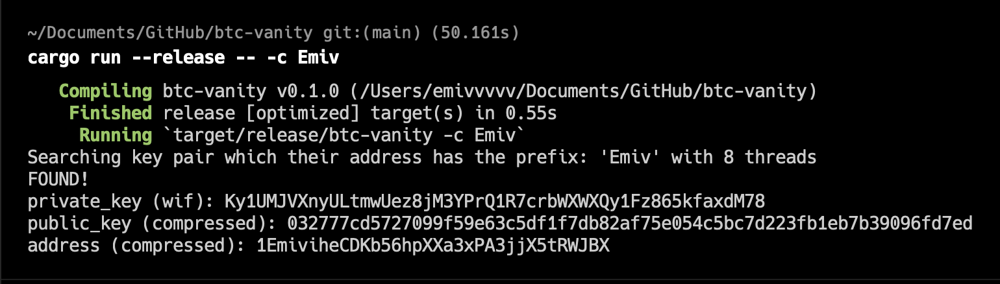
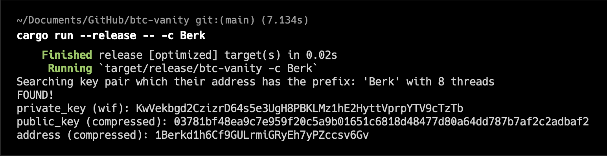

#  btc-vanity

A bitcoin vanity address generator written with the Rust programming language.


## Screenshots

DO NOT USE THE PRIVATE KEYS ON THE SCREENSHOTS! NEVER EVER SHARE YOUR PRIVATE KEY! THESE ACCOUNTS ARE NOT IN USE! USING THESE ACCOUNTS MEAN YOU PROBABLY LOSE YOUR MONEY!





## Roadmap

|Status|Feature|
|------|-------|
|✅|Creating vanity addresses with a prefix|
|⏳|Adding suffix and anywhere options|
|⏳|Implementing case_sensitive: false|
|⏳|Taking input from a file to generate multiple wallets|
|...|...|

## Installation

```
$ cargo install btc-vanity
```
## CLI

```
Usage: btc-vanity [OPTIONS] <prefix>

Arguments:
  <prefix>  Prefix used to match addresses

Options:
  -t, --threads <threads>  Number of threads to be used [default: 8]
  -c, --case-sensitive     Use case sensitive comparison to match addresses
  -d, --disable-fast       Disables fast mode to find a prefix more than 4 characters
  -h, --help               Print help
  -V, --version            Print version
```