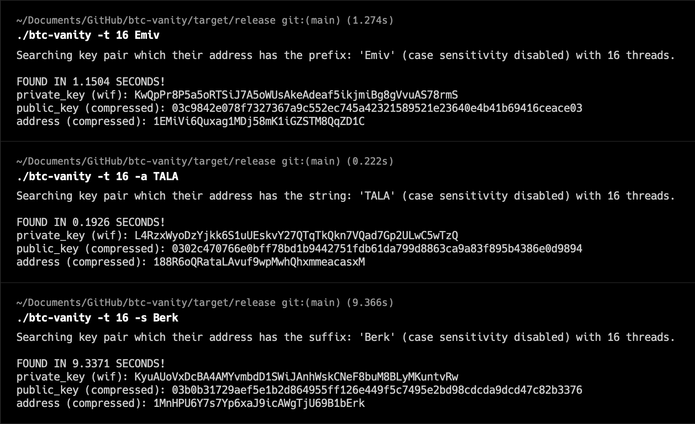
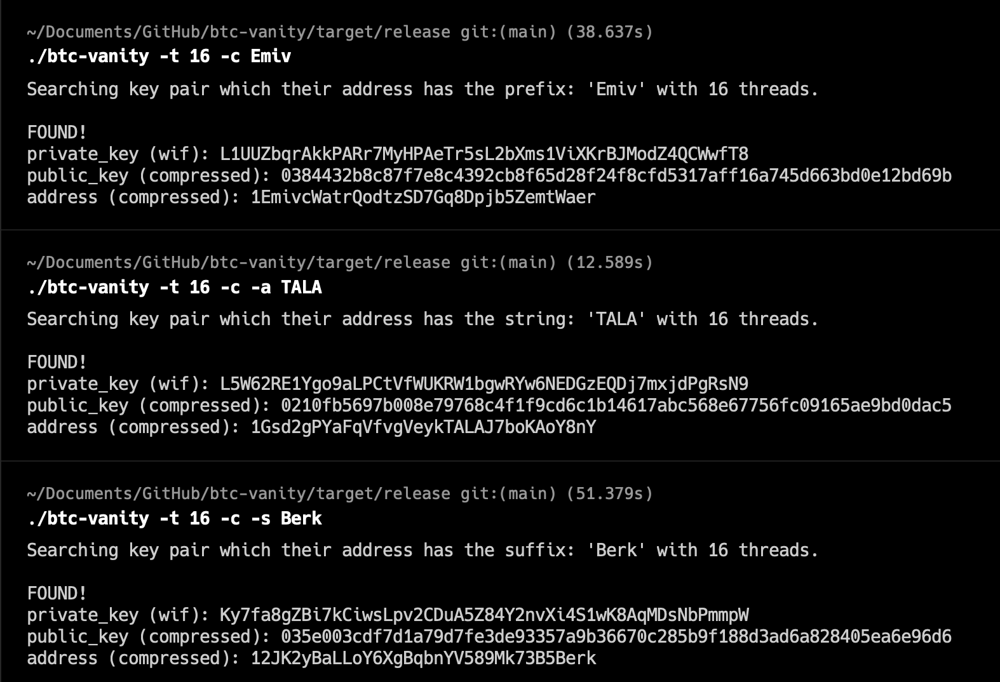
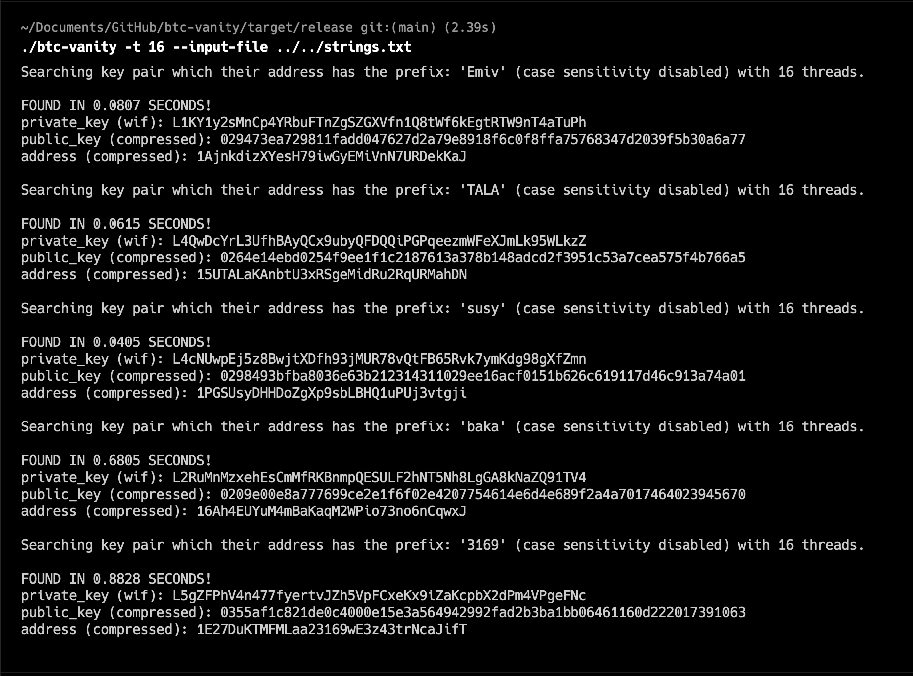

#  btc-vanity

A bitcoin vanity address generator written with the Rust programming language.

With btc-vanity you can create a private key which has a compressed bitcoin pay address that has a custom prefix, suffix or a string at somewhere in the address.

You can easily run btc-vanity at you computer to get your private key securely.

## Screenshots

DO NOT USE THE PRIVATE KEYS ON THE SCREENSHOTS! NEVER EVER SHARE YOUR PRIVATE KEY! THESE ACCOUNTS ARE NOT IN USE! USING THESE ACCOUNTS MEAN YOU PROBABLY LOSE YOUR MONEY!





## Roadmap

| Status |                                     Feature                                      | Version |
|:------:|:--------------------------------------------------------------------------------:|:-------:|
|   ✅    |                     Creating vanity addresses with a prefix                      | v0.1.0  |
|   ✅    |                        Adding suffix and anywhere options                        | v0.2.0  |
|   ✅    |                        Implementing case_sensitive: false                        | v0.3.0  |
|   ✅    |              Taking input from a file to generate multiple wallets               | v0.4.0  |
|   ✅    |               Implementing output file that contains found wallets               | v0.5.0  |
|   ✅    |           Getting flags from input file for each string and implement            | v0.6.0  |
|   ✅    |       More optimized, improved and structured code. A general refactoring        | v0.7.0  |
|   ✅    |                                  Documentation                                   | v0.8.0  |
|   ⏳    | A faster search engine function by sacrificing readability and code organization | v0.9.0  |
|  ...   |                                       ...                                        |   ...   |

I don't suggest you to use any version before v0.7.0

## Installation

```
$ cargo install btc-vanity
```
[btc-vanity crates.io](https://crates.io/crates/btc-vanity)


## Example Usages

```
$ btc-vanity -c -a Emiv
```

```
$ btc-vanity -s -o wallet.txt TALA
```

```
$ btc-vanity -f -p -c -i inputs.txt -o wallets.txt
```

## CLI

```
$ btc-vanity --help
A bitcoin vanity address generator written with the Rust programming language.

Usage: btc-vanity [OPTIONS] [string]

Arguments:
  [string]  String used to match addresses.

Options:
  -i, --input-file <input-file>    File with strings to match addresses with.
                                   Important: Write every string in a separate line.
  -f, --force-flags                Use this flag to override the flags in the input file
                                   or use in file to override cli flags for only that string.
                                   Note: Cli -f is stronger than input-file -f.
  -o, --output-file <output-file>  Crates a file that contains found wallet/s.
  -p, --prefix                     Finds a vanity address which has 'string' prefix. [default]
  -s, --suffix                     Finds a vanity address which has 'string' suffix.
  -a, --anywhere                   Finds a vanity address which includes 'string' at any part of the address.
  -t, --threads <threads>          Number of threads to be used. [default: 16]
  -c, --case-sensitive             Use case sensitive comparison to match addresses.
  -d, --disable-fast               Disables fast mode to find a prefix more than 4 characters.
  -h, --help                       Print help
  -V, --version                    Print version
```


## Documentation

[btc-vanity documentation](https://docs.rs/btc-vanity/latest/btc_vanity/index.html)

(At this time, documentation is unavailable. However, my top priority is to create a basic documentation as soon as possible.)


## Disclaimer

**USE WITH CAUTION AND UNDERSTANDING**

btc-vanity is a tool designed to assist users in generating customized vanity Bitcoin addresses using the Rust programming language. While btc-vanity aims to provide a secure and efficient method for generating vanity addresses, it is essential to exercise caution and follow best security practices.

1. **Security Awareness**: Generating and using vanity addresses involves the creation of private keys and public addresses. Private keys grant control over the associated Bitcoin funds. It is crucial to understand the risks involved in managing private keys and to never share them with anyone. Keep your private keys stored securely and never expose them to potential threats.

2. **Risk of Loss**: Improper use of btc-vanity, mishandling of private keys, or failure to follow security guidelines may result in the loss of Bitcoin funds. Always double-check the addresses generated and verify their accuracy before using them for transactions.

3. **Verification**: Before utilizing any vanity address generated by btc-vanity, thoroughly verify the integrity of the software and the generated addresses. Only use versions of btc-vanity obtained from reputable sources, such as the official crates.io page.

4. **Backup and Recovery**: Maintain proper backups of your private keys and any relevant data. In the event of device failure, loss, or corruption, having secure backups will help prevent irreversible loss of funds.

5. **Use at Your Own Risk**: The btc-vanity software is provided "as is," without any warranties or guarantees. The author(s) and contributors of btc-vanity shall not be held responsible for any direct or indirect damages, losses, or liabilities resulting from the use or misuse of this software.

6. **Educational Purposes**: btc-vanity is intended for educational and personal use. It is your responsibility to ensure compliance with any legal, regulatory, or tax requirements in your jurisdiction related to Bitcoin and cryptocurrency usage.

By using btc-vanity, you acknowledge and accept the risks associated with generating vanity addresses and handling private keys. It is your responsibility to exercise diligence, follow security best practices, and be aware of potential risks. If you are unsure about any aspect of using btc-vanity, seek guidance from experienced Bitcoin users or professionals before proceeding.

Remember, the security of your Bitcoin holdings is paramount. Always prioritize the safety and security of your assets.
