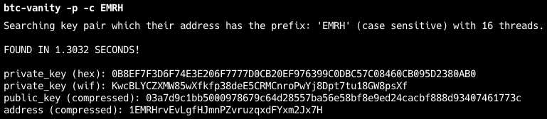
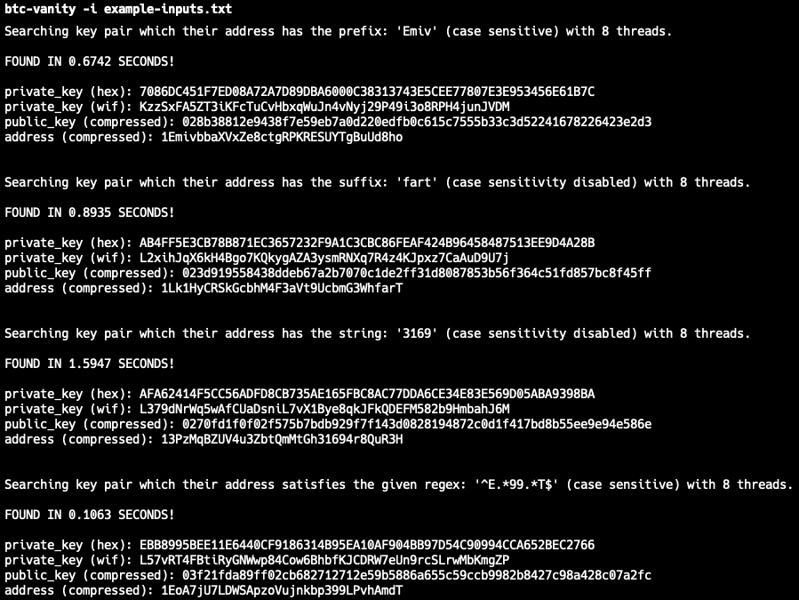

#  btc-vanity

A bitcoin vanity address generator written with the Rust programming language.

With btc-vanity, you can create a private key that generates a compressed Bitcoin pay address featuring a custom prefix, suffix, a specific string, or even a pattern matching your custom regex!

You can easily run btc-vanity terminal application locally or use it as a library to create your vanity keypair securely.

## Screenshots

DO NOT USE THE PRIVATE KEYS ON THE SCREENSHOTS! NEVER EVER SHARE YOUR PRIVATE KEY! THESE ACCOUNTS ARE NOT IN USE! USING THESE ACCOUNTS MEAN YOU PROBABLY LOSE YOUR MONEY!




## Features

- **Flexible Address Customization**: Generate Bitcoin addresses with custom prefixes, suffixes, patterns matching your desired regex, or specific strings located anywhere in the address, with optional case insensitivity for enhanced flexibility.
- **Case Insensitivity Support**: Option to ignore case when searching for vanity addresses.
- **Batch Wallet Generation**: Input a file containing multiple desired addresses and generate wallets in bulk.
- **Output Wallets to File**: Automatically save generated wallet addresses to an output file for easy access.
- **Configurable Flags**: Use an input file to pass custom flags for each desired wallet address.

## Installation

```
$ cargo install btc-vanity
```
[btc-vanity crates.io](https://crates.io/crates/btc-vanity)


## Example Usages

```
$ btc-vanity -c -a Emiv
```

```
$ btc-vanity -s -o wallet.txt fart
```

```
$ btc-vanity -r ^E.*99.*T$
```

```
$ btc-vanity -f -p -c -i inputs.txt -o wallets.txt
```

## Documentation

[btc-vanity documentation](https://docs.rs/btc-vanity/latest/btc_vanity/index.html)


## Disclaimer

**USE WITH CAUTION AND UNDERSTANDING**

btc-vanity is a tool designed to assist users in generating customized vanity Bitcoin addresses using the Rust programming language. While btc-vanity aims to provide a secure and efficient method for generating vanity addresses, it is essential to exercise caution and follow the best security practices.

1. **Security Awareness**: Generating and using vanity addresses involves the creation of private keys and public addresses. Private keys grant control over the associated Bitcoin funds. It is crucial to understand the risks involved in managing private keys and to never share them with anyone. Keep your private keys stored securely and never expose them to potential threats.

2. **Risk of Loss**: Improper use of btc-vanity, mishandling of private keys, or failure to follow security guidelines may result in the loss of Bitcoin funds. Always double-check the addresses generated and verify their accuracy before using them for transactions.

3. **Verification**: Before utilizing any vanity address generated by btc-vanity, thoroughly verify the integrity of the software and the generated addresses. Only use versions of btc-vanity obtained from reputable sources, such as the official crates.io page.

4. **Backup and Recovery**: Maintain proper backups of your private keys and any relevant data. In the event of device failure, loss, or corruption, having secure backups will help prevent irreversible loss of funds.

5. **Use at Your Own Risk**: The btc-vanity software is provided "as is," without any warranties or guarantees. The author(s) and contributors of btc-vanity shall not be held responsible for any direct or indirect damages, losses, or liabilities resulting from the use or misuse of this software.

6. **Educational Purposes**: btc-vanity is intended for educational and personal use. It is your responsibility to ensure compliance with any legal, regulatory, or tax requirements in your jurisdiction related to Bitcoin and cryptocurrency usage.

By using btc-vanity, you acknowledge and accept the risks associated with generating vanity addresses and handling private keys. It is your responsibility to exercise diligence, follow security best practices, and be aware of potential risks.

Remember, the security of your Bitcoin holdings is paramount. Always prioritize the safety and security of your assets.
